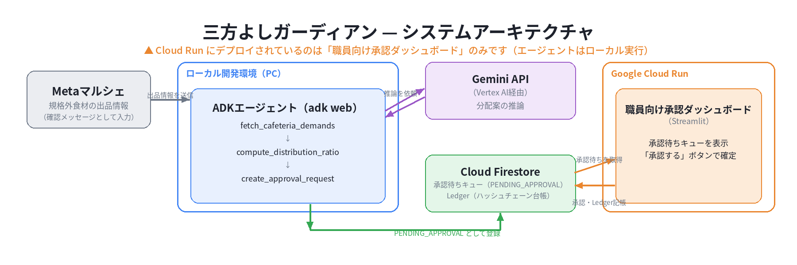

# 三方よしガーディアン

**Agentic AIによる規格外食材マッチング × 子ども食堂向け自律型監査エージェント**
（第5回 Agentic AI Hackathon with Google Cloud 応募プロジェクト）

> **Elevator Pitch**
> 規格外食材の出品をAIが自律的に検知し、近隣の子ども食堂への最適な分配から、支援者向けの透明性の高い会計・監査レポートまでを自動生成するプラットフォームです。

🚀 **[稼働中のデモ（職員向け承認ダッシュボード）](https://sanpoyoshi-guardian-dashboard-e3sjywoowa-an.a.run.app)**
🎥 **[デモ動画のURLをここに記載]**

## 課題
子ども食堂の急増と物価高騰が続く中、企業や個人からの資金・食材提供は「不正受給への懸念」と「使途の説明責任（監査対応の多大なる労力）」という壁に阻まれ、停滞しています。現場の職員は日々の運営に追われ、複雑な事務処理にリソースを割くことができません。

## ソリューション
Metaマルシェへの規格外食材の出品をエージェントが自律的に監視し、以下のプロセスを自動化します。

1. **自律的マッチング:** 食材の鮮度や量、近隣子ども食堂のニーズをGeminiが推論し、最適な分配案を起案。
2. **ハッシュチェーンによる監査レポート生成:** マッチング履歴と会計処理案をADK×Gemini APIで自動生成し、改ざん検知可能なハッシュチェーン台帳として記録。
3. **Human-in-the-loop設計:** 最終的な分配・会計決定は必ず現場職員が承認ダッシュボードからワンクリックで行い、安全性と正確性を担保。

## アーキテクチャ


## 技術スタック
- **Google Cloud Run:** 職員向け承認ダッシュボード（Streamlit）のホスティング
- **Agent Development Kit（ADK）:** 監視・推論・起案を行う自律型エージェントのオーケストレーション
- **Gemini API（Vertex AI経由）:** 非構造化データの解釈、最適な分配案の推論、監査レポートの生成
- **Cloud Firestore:** マッチングデータ・承認ステータス・ハッシュチェーン台帳のリアルタイム同期・保存
- **Streamlit:** 職員向け承認ダッシュボードのUI

## ローカル起動手順
```bash
git clone https://github.com/SunVerdir/sanpoyoshi-guardian.git
cd sanpoyoshi-guardian
python -m venv venv
venv\Scripts\activate.bat
pip install -r requirements.txt
```

Firestoreエミュレータを別ターミナルで起動します（ローカル動作確認用）。
```bash
gcloud emulators firestore start --host-port=localhost:8080
```

別ターミナルでエミュレータ接続用の環境変数をセットしてから、エージェントを起動します。
```bash
set FIRESTORE_EMULATOR_HOST=localhost:8080
cd agent
adk web
```
ブラウザで http://127.0.0.1:8000 を開くと、エージェントとの対話を確認できます。

さらに別ターミナルで承認ダッシュボードを起動します。
```bash
set FIRESTORE_EMULATOR_HOST=localhost:8080
streamlit run dashboard\app.py
```
ブラウザで http://localhost:8501 を開くと、承認待ちキューの確認・承認ができます。

## Cloud Runへのデプロイ
```bash
gcloud run deploy sanpoyoshi-guardian-dashboard --source . --region asia-northeast1 --allow-unauthenticated
```

初回デプロイ時は、本番用Firestoreデータベースの作成も必要です。
```bash
gcloud firestore databases create --location=asia-northeast1 --project=<PROJECT_ID>
```

## ディレクトリ構成
```
.
├── agent/           # ADKエージェント本体（ツール定義・監視・起案ロジック）
├── dashboard/       # 職員用承認ダッシュボード（Streamlit）
├── firestore/       # データモデル定義・ハッシュチェーン台帳実装
├── tests/           # 単体テスト
└── docs/            # アーキテクチャ図・スクリーンショット等
```

## ライセンス
MIT License